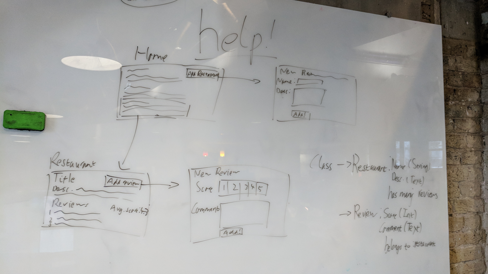

# Gritinho

*Building a Yelp clone in Rails*

[Introduction](#introduction) | [Running the App](#running-the-app) | [Approach](#approach) | [Challenges](#challenges)

## Introduction

Gritinho is our implementation of the Makers Academy Week 8 challenge, the full spec for which can be found [here](https://github.com/makersacademy/course/blob/master/rails/yelp_project_specification.md). In short, the challenge was to build a clone of Yelp using Rails, and the goal of the project was to gain comfortability with Rails, none of ussed the framework before.

## Running the App

To run this application, first ensure you have Ruby [installed](https://www.ruby-lang.org/en/documentation/installation/), as well as the [bundler gem](http://bundler.io/) and [PostgreSQL](https://www.postgresql.org/). Fork or clone this repo, and run `bundle install` from the command line to install dependencies. Then, run `rails db:create` to create the databases, and `rails db:migrate` to seed them.

Run `bin/rail s` to launch a server, and then visit the correct port on the localhost to view the app. In rails, this is http://localhost:3000 by default.

## Approach

Our approach to this challenge was to first diagram out what had been defined as the MVP (see specification above), and work out what the different components we would need to build this were. A photo of this is displayed below.

Following the creation of our MVP, we continued following the challenge specification (see above), dividing into two teams to work on user authentication and permissions.

## Challenges

The main challenge for this project was learning how to get to grips with Rails and its design patterns, none of us having used the framework before. Another challenge was in using the Oauth authentication technology for the first time, to allow users to sign in via Google. To overcome each of these challenges, this week involved a lot of research and reading of documentation to establish exactly how these new technologies that we were working with functioned.

Gritinho was built by [Gabi](https://github.com/gabrielabud), [Peter](https://github.com/peterwdj), [Theo](https://github.com/somemarsupials/), and [Tiago](https://github.com/Eustaquio122).

<!-- # README

This README would normally document whatever steps are necessary to get the
application up and running.

Things you may want to cover:

* Ruby version

* System dependencies

* Configuration

* Database creation

* Database initialization

* How to run the test suite

* Services (job queues, cache servers, search engines, etc.)

* Deployment instructions

* ... -->
